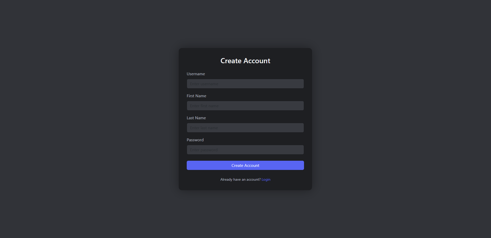

# COMP3133 Lab Test 1 -- Chat Application

## Student Information

-   **Name:** Andrei Jhoseph Gania
-   **Student ID:** 101478350
-   **Course:** COMP3133
-   **Lab Test:** Lab Test 1
-   **Repository Name:** studentID_lab_test1_chat_app

------------------------------------------------------------------------

# Features Implemented

## 1. User Authentication

-   Signup with unique username
-   Login with credential validation
-   User data stored in MongoDB
-   Session maintained using localStorage
-   Logout functionality implemented

### Login Page

### Signup Page

## 2. Room-Based Chat

Predefined rooms: - devops - cloud computing - covid19 - sports - nodeJS

Users can: - Join a room - Leave a room - Chat only inside joined room

Messages are stored in MongoDB and the last 25 messages load when
joining a room.

## 3. Private Messaging

-   1-to-1 private chat between users
-   Private message history loads when chat opens
-   Messages stored in MongoDB
-   Real-time delivery using Socket.io

## 4. Typing Indicator

-   Room typing indicator
-   Private message typing indicator

------------------------------------------------------------------------

# Database Structure

## User Collection

{ username: String (unique), firstname: String, lastname: String,
password: String }

## GroupMessage Collection

{ from_user: String, room: String, message: String, date_sent: String }

## PrivateMessage Collection

{ from_user: String, to_user: String, message: String, date_sent: String
}

------------------------------------------------------------------------

# Installation & Setup

1.  Clone the repository git clone
    https://github.com/YOUR_USERNAME/studentID_lab_test1_chat_app.git

2.  Install dependencies npm install

3.  Start MongoDB locally or configure .env file with:
    MONGODB_URI=your_connection_string

4.  Run the server node server.js

Server runs at: http://localhost:3000

------------------------------------------------------------------------

# Requirements Checklist

✔ GitHub repository created\
✔ Signup page implemented\
✔ Login page with localStorage\
✔ Room join/leave functionality\
✔ Room-based chat with Socket.io\
✔ Messages stored in MongoDB\
✔ Private messaging\
✔ Typing indicator\
✔ Logout functionality
